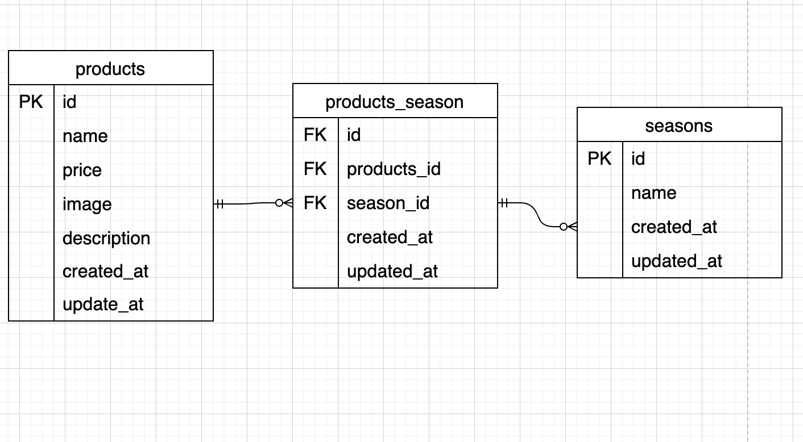

# もぎたて

## 環境構築

### Dockerビルド
1. git clone git@github.com:KT0428/mogitate-test.git
2. cd mogitate-test
3. docker-compose up -d --build

### Laravel環境構築
1. docker-compose exec php bash
2. composer install
3. cp .env.example .env
4. php artisan key:generate
5. php artisan migrate
6. php artisan db:seed
7. php artisan storage:link

## 使用技術（実行環境）

- PHP 8.1.34
- Laravel 10.x
- MySQL 8.0.26
- Docker
- nginx

## ER図

## URL

- 商品一覧：http://localhost/products
- 商品登録：http://localhost/products/register
- phpMyAdmin：http://localhost:8080/